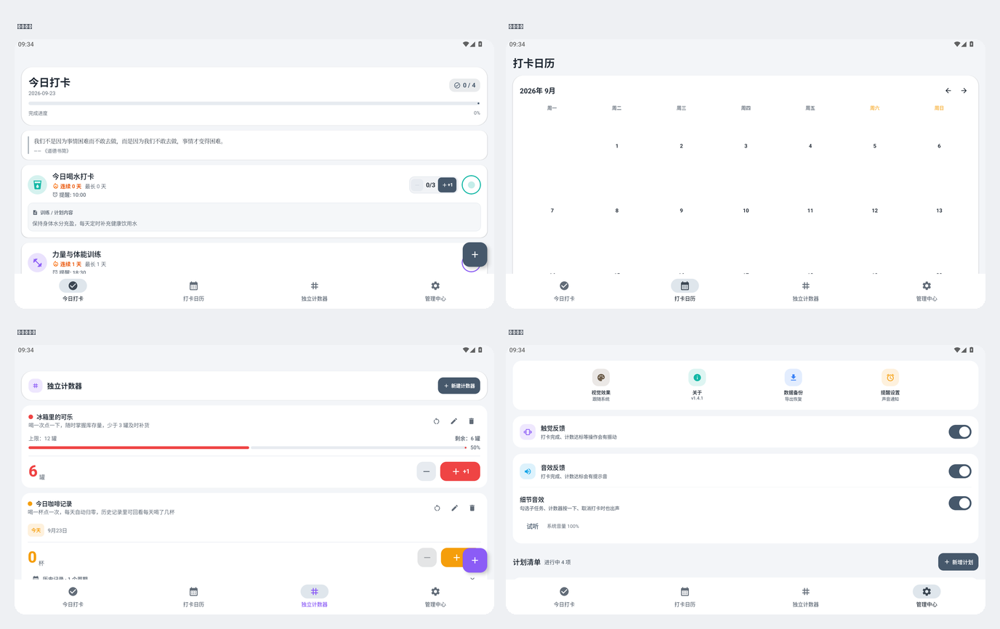
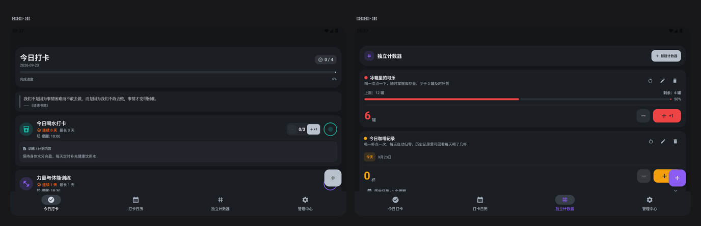

# 未竟 · Weijing

> 一个自己用的习惯打卡 App。名字取自「有始有终」的反面 —— 记下来的事，大多未竟。

原生 **Android** 习惯追踪应用，**Kotlin + Jetpack Compose + Material 3 + Room**，
100% 本地存储、无账号、无埋点。主要给自己和身边人用，顺手开源。

当前版本 **1.4.1**（`versionCode 10401`）· Android 10 ~ 15（API 29 ~ 35）



<details>
<summary>暗色主题（墨曜）</summary>



</details>

---

## 它解决什么

市面上打卡 App 大体两类：要么太轻（只有「今天做了没」），要么太重（社交、会员、排行榜）。
「未竟」只做一件事：**让「今天该做什么」和「这个月做了多少」一眼看得见**，并且不起第二屏。

几个做的时候真正在意过的点：

- **本地优先。** 打卡记录、照片凭证、备注全部只存在手机里。App 唯一的联网行为是取一句每日格言（见下），除此之外不发任何请求。数据导出是一份 JSON 文件，你拿去哪儿都行。
- **照片凭证是真的存下来。** 从系统相册选的照片会流式复制进应用私有目录 —— 相册里那张删了、手机重启了，打卡凭证依然打得开。
- **打卡提醒精确到分钟。** 用 `AlarmManager.setExactAndAllowWhileIdle` 而不是 `Handler`/`WorkManager` 那种「大概这个点」。重启后自动重排，通知上直接带一键打卡。
- **手感是设计的一部分。** 打卡、撤销、计数器踩满目标都有独立的触觉与音效，不是所有操作都「嗡」一下了事。

## 功能一览

四个页签，没有第五个。

### 今日
- 环形进度卡：今天完成几项、还剩几项
- 今日排期列表：支持大计划（含细化小计划，逐项勾选）、计数器型习惯（如「喝水 3 杯」点一次加一杯）
- **当天没有排期时不显示空列表**，而是给一张说明卡 + 未来 60 天内即将到来的计划
- 底部一句话每日格言（联网优先，断网自动回退内置的 64 条库）

### 历史
- 月历视图：每一天用状态点标出「已完成 / 部分完成 / 未完成」，可翻月、可跳回今天
- 点任意一天看当天完整清单，未打卡的可以补打卡
- 下方是倒序的打卡流水，点缩略图全屏查看凭证原图

### 计数器
- **独立计数器**：和习惯解耦的纯计数工具（「冰箱里的可乐还剩几罐」这种）
- 支持设置上限、自定义步长与单位
- **自动周期归零**：按天 / 周 / 月 / 每 N 天重置，归零时把这一周期的结果写进历史，记录不丢

### 管理中心
- 视觉效果：6 套配色（宣纸 / 雾霭 / 青瓷 / 墨曜 / 午夜 / 暖夜）+ 跟随系统
- 计划清单：集中管理所有习惯与计划，支持归档、批量操作
- 数据备份：导出 / 导入 JSON 备份，换机迁移靠它
- 提醒设置：通知权限引导、系统音量诊断
- 关于：版本信息与手动检查更新

## 技术要点

| 项目 | 值 |
|---|---|
| 语言 / UI | Kotlin · Jetpack Compose · Material 3 |
| 存储 | Room（version 4），无 `fallbackToDestructiveMigration` |
| 最低 / 目标 | minSdk 29 · targetSdk 35 · compileSdk 35 |
| 构建 | Gradle 8.9 · AGP 8.x · JDK 17 |
| 依赖 | 只用 Compose BOM + Room + Coil + `material-icons-core` |
| 代码规模 | 约 13,000 行 Kotlin / 57 个文件 |
| 单元测试 | 9 个测试类 · 113 条用例 |
| APK | release ≈ 21 MB（未开 R8，理由见下） |

### 几个刻意的取舍

**不引入 `material-icons-extended`。** 那个包 2000+ 图标、35.7 MB，而本工程只用三十来个。
它作为 jar 依赖在不开 R8 时会**整体**进 dex，曾把 APK 顶到 **58.97 MB**；改成本地自绘
（`ui/components/HabitIcons.kt`，路径数据取自官方 Material Icons 的 SVG `d` 串，Apache-2.0）后降到 **20.90 MB**。

**不开 R8 / 资源压缩。** 开了能压到 3 MB 量级，代价是崩溃栈全成混淆名 ——
必须归档 `mapping.txt` 才能定位线上崩溃。20 MB 已经够用，不值得为此引入这份长期排查成本。

**没有 `ACCESS_NETWORK_STATE` 权限。** 唯一的联网调用直接发、失败就降级。
无网络时 `UnknownHostException` 是立刻抛出的，不需要先探测一遍。少一个权限就少一份解释成本。

**迁移禁用 `fallbackToDestructiveMigration()`。** 每一次表结构变更都写显式 `Migration`
并导出 schema JSON 进版本管理。宁可多写一段迁移代码，也不接受「升级一下数据全没了」。

**每联网失败都是静默的。** 格言接口挂了 → 用内置库；更新源挂了 → 当作「没有新版」。
用户永远不该因为一个锦上添花的功能看到错误弹窗。

## 联网边界

这是全 App **唯一**一处网络行为，写清楚是为了它不被后来者无意扩大。

**请求**：发往 `https://card.gudong.site/api/random-note` 的单向 `GET`。
不带设备标识、不带用户标识、不带 Cookie，**不上传任何打卡记录 / 照片 / 备注 / 备份**。

**降级链**（任何一环失败都安静地往后走，界面不出现加载态或空白）：

1. 当天已有远程缓存 → 直接用，不发请求
2. 没有缓存 → 异步拉一次（3s 连接 / 3s 读取），内容通过 `QuotePolicy` 校验才落盘
3. 无网络 / 超时 / 接口挂掉 / 内容不合格 → 保持内置库当天的句子

**首帧不等网络**：格言初值就是内置库里当天的句子，远程结果回来才替换 —— 接口实测首包要 4 秒，等它等于让用户对着空白发呆。

**为什么每天只请求一次**：该接口是「随机漫步」，每调一次换一句；不按天缓存的话，同一天不同时刻看到的句子都不一样，那就不叫每日格言了。

**已知风险**：接口由个人开发者维护，无可用性承诺，可能改协议或下线 —— 所以它只是锦上添花，内置库才是保底。接口不接受任何查询参数，实测 8 次有 3 次返回佛学内容，因此在客户端按 `collectionId` / `tags` 做了过滤。

<details>
<summary><b>想彻底关掉联网？</b></summary>

删掉 `AndroidManifest.xml` 里的 `INTERNET` 权限、以及 `TodayScreen` 里那次 `refreshTodayQuote` 调用即可 —— 其余代码会自然退回内置库，无需其他改动。（注意：应用内自更新也会一起失效。）

</details>

## 应用内自更新

应用会自己在应用内检查、下载并调起安装新版本，不必再往群里丢 APK。分发源刻意做成**双源**：

| 源 | 角色 | 说明 |
|---|---|---|
| **Gitee 发行版** | 主源 | 国内直连，实测首页 `connect 0.039s` / TLS `0.12s`，附件可**匿名**直链下载 |
| **GitHub Releases** | 备源 | Gitee 挂掉或没发版时兜底 |

两个源**并行查询、取 `versionCode` 大的那条**。这是刻意的：单一源的失败是**静默**的 —— 用户只会看到「已是最新」，永远收不到更新，且没有任何报错可查。

触发时机是**每次冷启动**（`AppSettings.lastUpdateCheckAt` 做 24 小时限频），发现新版本后弹出应用内对话框，走「下载 → 校验 → 引导开启安装权限 → 调起系统安装器」。

> ⚠️ **没有「静默自动安装」这回事。** Android 强制要求用户在系统界面点一次「安装」，
> 首次还要先授权「允许安装未知应用」。能优化掉的只有「去群里翻文件」这一段。

> 🚨 安装前会严格校验 APK 的 `longVersionCode` 与发布信息是否**完全相等**，
> 不等就直接「已阻止安装」。这是为了防止把错版本的包装上去。

## 构建

```bash
cd android
./gradlew :app:assembleRelease     # 产物：app/build/outputs/apk/release/app-release.apk
./gradlew :app:testDebugUnitTest   # 跑 113 条单元测试
```

用 Android Studio 打开则选择 `android` 目录（不是仓库根目录）。
需要 JDK 17；Gradle Wrapper 会自己拉对应版本。

`keystore.properties` 缺失时 release 构建会**在签名阶段直接报错** —— 刻意设计，避免悄悄产出一个「装不上」的未签名 APK。

## 发版

1. `app/build.gradle.kts` 里 `versionCode` / `versionName` **一起改**
2. `:app:assembleRelease`
3. 发到 Gitee（脚本会比对版本自洽性 → 校验 APK → 建发行版 → 传附件 → 回读确认）：

   ```bash
   cd android
   python release_gitee.py --notes "本次更新内容"
   python release_gitee.py --dry-run        # 只看会做什么
   python release_gitee.py --prune 3        # 只保留最近 3 个版本
   ```

需要 Gitee 私人令牌，优先读环境变量 `GITEE_TOKEN`。

> 🔴 **`versionCode` 编码规则是 `major*10000 + minor*100 + patch`。**
> 只改 `versionName` 不改 `versionCode` = 没发新版，用户收不到更新。
> 也别用「和 versionName 末段对齐」的写法 —— 那样 1.0.1 和 1.1 会撞成同一个数。

> 🔴 **签名密钥不进仓库。** `release.keystore` + `keystore.properties` 已 gitignore。
> 这两样丢了就永远无法再给已安装用户发新版（签名不一致会被系统拒绝覆盖安装，
> 用户只能卸载重装、数据全丢）。请离线备份到两处。

> ⚠️ Gitee 免费版限制：单附件 ≤ 100MB、仓库附件总量 ≤ 1GB。按 21MB 一个包算约 47 个版本就满了，
> 用 `--prune` 定期清理，否则新版传不上去。

## 目录结构

```
android/
└── app/src/main/java/io/github/molishadaze/weijing/
    ├── data/           Room 实体、DAO、Repository、备份编解码、更新源
    ├── model/          UI 层数据模型（HabitWithStats / SubTask / UpcomingHabit）
    ├── notification/   通知渠道、闹钟接收器、开机重排、通知栏一键打卡
    ├── ui/
    │   ├── components/ 卡片、弹窗、表单组件、月历、自绘图标
    │   ├── screens/    今日 / 历史 / 计数器 / 管理中心 四个页面
    │   └── theme/      6 套配色，禁用 Material You 动态取色
    ├── util/           排期与连续天数计算、备份、触觉音效、更新策略
    └── viewmodel/      HabitViewModel（唯一的 ViewModel）
```

## 开源说明

**这是个人自用项目，不接受 PR。** 需求与改动方向由我自己定，提 PR 大概率会被关掉 ——
不是不尊重你的时间，而是这个 App 的设计取舍（比如「不要第五个页签」「不加社交」）
是刻意做出的，掺进来会让它长成另一个东西。

**欢迎提 Issue**，尤其是：装不上 / 崩溃 / 数据丢失 / 备份导不进来这类**可复现的 bug**。
请带上机型、Android 版本、复现步骤；有 logcat 更好。

代码可以随意阅读、学习、fork 自用。图标路径数据来自官方 Material Design Icons（Apache-2.0）。

## License

代码未附正式开源许可证，保留所有权利。可以读、可以 fork 自用，但请不要以本项目的名义分发或发布衍生版本。

---

<p align="center"><sub>「有始有终」很难 —— 所以先把「始」记下来。</sub></p>
